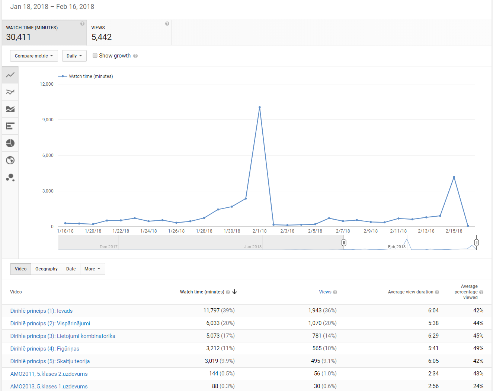

**Anotācija:** Šeit apkopota statistika par YouTube atskaņošanas sarakstu 
<https://www.youtube.com/playlist?list=PL9y-YK2_qNJEC9fEjKiPaWsKtGX2a3aCz> un
arī Dirihlē principa testu - 
sk. <http://www.dudajevagatve.lv:8080/exam/examlist.html>. Mūsu mērķis
ir labāk saprast lietotāju uzvedību pirms olimpiādēm 
un noskaidrot labāk vai sliktāk sastādītos testu jautājumus, 
ņemot vērā iesūtītās atbildes. 


## YouTube klipi

Pavisam ir 5 klipi par Dirihlē principu. Tabulā parādīts, cik 
reizes katrs video pieprasīts 30 dienu laikā: no 
2018-01-18 (kad norādi ievietoja NMS mājaslapā) 
līdz 2018-01-16 (kad notika novadu olimpiāde 
5.–8.klasei). Katram video minēts, cik minūtes tas vidēji skatīts.
Šo piecu klipu garums ir 11–15 minūtes, 
lietotāji caurmērā noskatījās 40–50\% no pilna video garuma.

| Klipa nosaukums | Minūtes | Skatījumi | Cik \% no pilna video |
| ------------- | --------------:| -----:| -----:|
| Dirihlē princips (1): Ievads | 11797  | 1943 | 42\% |
| Dirihlē princips (2): Vispārinājumi |  6033 | 1070 | 44\% |
| Dirihlē princips (3): Lietojumi kombinatorikā | 5073 | 781 | 45\% |
| Dirihlē princips (4): Figūriņas | 3212 | 565 | 49\% |
| Dirihlē princips (5): Skaitļu teorija | 3019 | 495 | 42\% |

### Īpašās dienas pirms olimpiādes 

Skatīšanās laiks un skatījumu skaits dienā būtiski atkarīgs no 
olimpiāžu grafifka. 
Tieši iepriekšējā dienā pirms Novada 
olimpiādes (2018-02-01 un 2018-02-15) bija vislielākā aktivitāte.
Lietotāju aktivitāte kanālā <https://www.youtube.com/user/kalvisapsitis1/videos>
pieskaita klāt arī dažus desmitus citu video, kur risināti 
atklāto olimpiāžu uzdevumi, bet pēdējā mēneša laikā 
gandrīz viss laiks (ap 97\%) bija Dirihlē principa video,
tādēļ grafiks parāda pieprasījumu izmaiņas tieši 
šiem pieciem video.

1.februārī un 15.februārī skatīšanās laiks bija attiecīgi 
10053 un 4163 minūtes, kas veido 46.7\% no kopējā skatīšanās
laika (30411 minūtes) visa mēneša laikā.




Arī lietotāju intereses sadalījums starp visiem 5 Dirihlē principa
video pirmsolimpiādes dienās 
atšķiras no pārējā laika. Lai to parādītu, 
apskatīsim divus laika intervālus: divu dienu intervālu 
(2018-01-31 un 2018-02-01) - tieši pirms novada olimpiādes 9.-12.klasēm un 
divpadsmit dienu intervālu (2018-02-03 - 2018-02-14), kas ir 
pēc 2.februāra, bet pirms 16.februāra, kad notika novadu olimpiāde
5.-8.klasēm. 

1-2 dienas pirms olimpiādes ir pieprasīti 
dažādi video par Dirihlē principu, pat ja 
atskaņošanas saraksta sākumā esošie video ir 
populārāki ("(1) Ievads" veido 29.6\%, bet 
"(5) Skaitļu teorija" veido 12.3\% no visa skatīšanās laika). 
Savukārt olimpiāžu starplaikā skatīšanās aktivitāte ir būtiski 
zemāka, toties pašu pirmo video "(1) Ievads" pieprasa 
skatās 46.1\% no visa laika. Abās sektoru diagrammās 
ar pelēko atzīmēti visi pārējie video, kuri nav par 
Dirihlē principu.


### YouTube lietotāja portrets

Ierīces, no kurām lietotāji skatās YouTube video, ir 
pārsvarā galda datori (67\%) un mobilie telefoni (27\%). 


Starp video lietotājiem vairums ir pieaugušie; 
sievietes un vīrieši ir 
līdzsvarā. Pārsteidzošs ir vīriešu pārsvars 25-34 gadu vecuma grupā. 
Tā varētu būt arī Google analītikas rīku neprecizitāte - tie, kuri 
palīdzējuši skolēniem veidot GMail kontus, saskaras ar 
problēmu - ja nesamelo par vecumu, tad kontu neļauj izveidot 
(vai arī vajadzīgs formāls vecāku apstiprinājums). 
Tādēļ iespējams, ka daļai skolēnu dzimšanas gads 
bijis jānorāda nepareizi. 
YouTube video iespējams pieprasīt arī no tādām pārlūkprorammas
sesijām, kurās nav uzstādīta Google autentifikācijas
sīkdatne (*cookie*) - mums nav zināms, kā demogrāfijas datus piesaista
šādiem lietotājiem. 


### YouTube olimpiāžu video kopš 2014.gada

Google analītika pieejama arī par agrākiem gadiem. 
Jau kopš 2014.gada links uz video kanālu 
<https://www.youtube.com/user/kalvisapsitis1/videos> 
ir ievietots NMS Atklāto olimpiāžu lapā. Arī šajā laikā bija 
līdzīga parādība – video pieprasījumi sasniedza 
lokālus maksimumus iepriekšējā dienā pirms atklātajām olimpiādēm. 
2018.gads atšķiras ar reklamēšanas veidu NMS lapā, tādēļ 
maksimums sasniegts īsi pirms novadu olimpiādes (divi augstākie
pīķi grafika labajā pusē).


## Testu kārtošanas aktivitāte

7.attēlā parādīts nosūtīto testu kopskaits katrā no dienām 
(katrā stabiņā eksāmeni grupēti 
atbilstoši pieprasītā testa tipam). Populārākais tests ir 
"intro" (Dirihlē principa ievads – pirmais
no pilnajiem testiem). Tests "random" (ar $10$ nejauši sajauktiem jautājumiem)
netika īpaši bieži pieprasīts; lietotāji deva priekšroku testiem par šauri 
definētu tēmu.

8.attēlā parādīts iesūtīto testu īpatsvars atkarībā no kopvērtējuma (to iegūst
izdalot iegūto punktu skaitu ar maksimālo, kas ir $10$ vai $15$ atkarībā no testa veida).  
Ievērojama daļa iesūtīto testu formu ir tukšas vai bez nevienas pareizas atbildes.

```{r bars1, fig.width=6.5, fig.height=4, echo=FALSE, message=FALSE, warning=FALSE, fig.cap=paste("7.att\u0113ls: Testu skaits pa dien\u0101m")}
setwd("/Users/kapsitis/workspace/exam/pigeonhole-reports/")

require(plyr)
require(Unicode)
require(ggplot2)
require(RColorBrewer)

sessionsALL <- read.table(
  file="sessions.csv", 
  sep=",",
  header=TRUE,
  row.names=NULL,  
  fileEncoding="UTF-8")

myPalette <- brewer.pal(6, "Set1")

sessionsALL$examCount = rep(1,times=nrow(sessionsALL))

sessionsALL$examType <- factor(sessionsALL$examType, 
                                     levels = c("random","intro","generalizations","combinatorics", "shapes", "number-theory"))

# sessionsAggregate <- 
#   aggregate(examCount ~ YyyyMmDd + examType, 
#             data = sessionsALL, 
#             FUN=sum)

barPlot <- 
  ggplot(data = sessionsALL, 
         aes(x = YyyyMmDd, y=examCount, fill = examType)) + 
  geom_bar(stat="identity") +
  scale_fill_manual(values=myPalette) +
  scale_x_discrete(limits = rev(levels(sessionsALL$YyyyMmDd))) +
  labs(x = "Datums", y="Testu skaits") +
  guides(fill=guide_legend(title="Testa veids"))+
  coord_flip() +
  theme_minimal()
barPlot
```


```{r pie1, fig.width=6, fig.height=4, echo=FALSE, message=FALSE, warning=FALSE, fig.cap=paste("8.att\u0113ls: Sadal\u012Bjums p\u0113c kopv\u0113rt\u0113jumiem")}

setwd("/Users/kapsitis/workspace/exam/pigeonhole-reports/")

require(plyr)
require(Unicode)
require(ggplot2)
require(RColorBrewer)

sessionsALL <- read.table(
  file="sessions.csv", 
  sep=",",
  header=TRUE,
  row.names=NULL,  
  fileEncoding="UTF-8")

#myPalette <- brewer.pal(6, "Set1")
myPalette <- rainbow(6)

## add dummy column with all ones
sessionsALL$examCount = rep(1,times=nrow(sessionsALL))

sessionsALL$examType <- factor(sessionsALL$examType, 
                               levels = c("random","intro","generalizations","combinatorics", "shapes", "number-theory"))

sessionsALL$percentage <- round(100*sessionsALL$totalGrade/sessionsALL$maxGrade, digits=2)

# scoreGroup
xx <- character()
for (i in 1:nrow(sessionsALL)) {
  if (sessionsALL$percentage[i] < 0.1) {
    tt <- "0%"
  } else if (sessionsALL$percentage[i] < 20.1) {
    tt <- "(0%;20%]"
  } else if (sessionsALL$percentage[i] < 40.1) {
    tt <- "(20%;40%]"
  } else if (sessionsALL$percentage[i] < 60.1) {
    tt <- "(40%;60%]"
  } else if (sessionsALL$percentage[i] < 80.1) {
    tt <- "(60%;80%]"
  } else {
    tt <- "(80%;100%]"
  }
  xx <- c(xx,tt)
}

sessionsALL$scoreGroup <- xx
sessionsALL$scoreGroup <- factor(sessionsALL$scoreGroup, 
                               levels = rev(c("0%","(0%;20%]","(20%;40%]","(40%;60%]", "(60%;80%]", "(80%;100%]")))


sessionsAggregate <- 
  aggregate(examCount ~ scoreGroup, 
            data = sessionsALL, 
            FUN=sum)


bp<- ggplot(sessionsAggregate, aes(x="", y=examCount, fill=scoreGroup)) +
  geom_bar(width = 1, stat = "identity") + 
  coord_polar("y", start=-pi/2, direction=-1) + 
  scale_fill_manual(values=rev(myPalette)) +
  guides(fill=guide_legend(title="Kopv\u0113rt\u0113jums"))+
  theme_minimal()+
  theme(
    axis.title.x = element_blank(),
    axis.title.y = element_blank()
  )

bp
```

Ja no testiem izvācam tukšās atbildes, iegūstam, ka 1. un 2. no testiem lietotāji 
izvēlējās jūtami biežāk nekā citus testus; turklāt ikvienā no testiem 
pirmais jautājums ir atbildēts krietni biežāk nekā turpmākie jautājumi. 
Pirmajam no testiem (jautājumi nr. 1-15 jeb ar unikālajiem identifikatoriem
**c.dirichlet.intro.q1** - **c.diriclet.intro.q15**) redzam, ka lietotāja 
pacietība lineāri samazinās, tuvojoties testa beigām: 15.jautājums 
visbiežāk atstāts neatbildēts. Tālāk redzam lokālus maksimumus 
16., 31., 46., 61.jautājumam - t.i. tajās vietās, kur sākas
attiecīgi testi "generalizations", "combinatorics", "shapes" vai "number-theory". 
Lietotāja pacietības samazināšanās, tuvojoties testa beigām, 
apgrūtina jautājumu salīdzināšanu pēc iesūtīto atbilžu statistikas. 


```{r bar2, fig.width=6, fig.height=4, echo=FALSE, message=FALSE, warning=FALSE, fig.cap=paste("9.att\u0113ls: Netuk\u0161o atbil\u017Eu skaits katram jaut\u0101jumam")}
setwd("/Users/kapsitis/workspace/exam/pigeonhole-reports/")

require(plyr)
require(Unicode)
require(ggplot2)
require(RColorBrewer)

questionsALL <- read.table(
  file="questions.csv", 
  sep=",",
  header=TRUE,
  row.names=NULL,  
  fileEncoding="UTF-8")

questionsALL$questionCount = rep(1,times=nrow(questionsALL))

keys <- as.numeric(names(table(questionsALL$item)))
vals <- as.vector(table(questionsALL$item))

## Remove all empty stuff
questionsFiltered <- 
  questionsALL[!grepl("^(\\s|,)*$",questionsALL$actual),]


corr <- numeric(0)
itemNum <- numeric(0)

for (i in 1:75) {
  qq1 <- questionsFiltered[questionsFiltered$item==i,]
  cc <- cor(qq1$grade, qq1$totalGrade)
  corr <- c(corr,cc)
  itemNum <- c(itemNum,i)
}

#barplot(corr, names.arg=itemNum)

qSummary <- 
  aggregate(grade ~ item, 
            data = questionsFiltered, 
            FUN=mean)
qCount <- 
  aggregate(questionCount ~ item,
            data = questionsFiltered,
            FUN=sum)
qUltimate <- merge(qSummary, qCount, by="item")

qUltimate$corr <- corr

cleaner <- qUltimate[abs(qUltimate$grade - 0.5) < 0.3, ]

##cleaner[with(cleaner, order(-corr)), ]


questionsFiltered$gradeCategorical <- paste0("",questionsFiltered$grade)

barPlot <- 
  ggplot(data = questionsFiltered, 
         aes(x = item, y=questionCount, fill = gradeCategorical)) + 
  geom_bar(stat="identity")+
  labs(x = "Jaut\u0101juma Nr.", y="Netuk\u0161\u0101s atbildes") +
  guides(fill=guide_legend(title="V\u0113rt\u0113jums"))+
  theme_minimal()
barPlot
```


## Jautājumi ar zemu vai augstu pareizo atbilžu īpatsvaru

No testu statistikas atradīsim jautājumus, 
kam ir neparasti zema vai neparasti augsta 
pareizas atbildēšanas varbūtība. Tabulā norādām jautājuma 
unikālo numuru, pareizo atbilžu īpatsvaru starp 
visām netukšajām atbildēm, visbeidzot - 
cik netukšu atbilžu par šo jautājumu pavisam ir. 


| Nr. | Pareizas atb. | Netukšās atbildes |
| ------------- | --------------:| -----:|
| c.dirichlet.combinatorics.q1 | *0.076* | 79 |
| c.dirichlet.combinatorics.q13 | *0.000* | 21 |
| c.dirichlet.combinatorics.q15 | *0.000* | 20 |
| c.dirichlet.shapes.q3 | *0.000* | 19 |
| c.dirichlet.shapes.q4 | *0.000* | 10 |
| c.dirichlet.shapes.q9 | *0.083* | 12 |
| c.dirichlet.nt.q8 | *0.000* | 10 |
| c.dirichlet.intro.q9 | **0.938** | 291 |
| c.dirichlet.intro.q14 | **0.883** | 214 |
| c.dirichlet.generalizations.q1 | **0.861** | 273 |
| c.dirichlet.generalizations.q2 | **0.858** | 233 |

### Grūti (vai nepareizi) jautājumi

Te minēsim tos jautājumus, kam pareizo atbilžu īpatsvars
mazāks par $0.1$. Tas var nozīmēt gan to, ka testu sistēmā ierakstīta
nepareiza atbilde vai arī uzdevums sastādīts nepareizi. 
Visos šajos gadījumos uzdevums būtu jāpārformulē vai arī 
jāpiedāvā risinātājam *ieteikumi*. 

**c.dirichlet.combinatorics.q1 ($P=0.076$):**
Konfektes iesaiņotas vairākās pakās, kurās var būt no $11$ līdz $20$ konfekšu. 
Cik konfekšu jāiesaiņo (vienalga kura lieluma pakās) tā, lai noteikti 
atrastos vai nu divas pakas ar vienādu 
konfekšu skaitu vai arī divas pakas ar konfekšu summu $31$?  
**Atbilde:** `91`

**c.dirichlet.combinatorics.q13 ($P=0.000$):**
Kāds mazākais skaits torņu jānovieto uz šaha galdiņa $6 \times 6$ rūtiņas, 
lai no tiem noteikti varētu izvēlēties trīs torņus, kuri 
viens otru neapdraud (t.i. neatrodas uz vienas horizontāles vai 
vienas vertikāles)?  
**Atbilde:** `13`

**c.dirichlet.combinatorics.q15 ($P=0.000$)**
Spēlētājs $A$ izvēlas $10$ divciparu skaitļus. Spēlētājs $B$
no tiem izvēlas netukšu apakškopu, t.i. vienu vai vairākus
skaitļus (varbūt arī visus $10$) no tiem, ko paņēma $A$.

1. Cik dažādos veidos $B$ to var izdarīt?
2. Vai neatkarīgi no $A$ izvēles, $B$ noteikti varēs atrast divas dažādas apakškopas, kurās skaitļu summas ir vienādas?
    a. Jā
    b. Nē
    
**Atbilde:** `1023,a`.


**c.dirichlet.shapes.q3 ($P=0.000$):**
Dots punktu režģis $5 \times n$. Visi punkti nokrāsoti zili vai sarkani (1.zīm.). 
Pie kāda $n$ tajā noteikti var atrast režģi $3 \times 3$, kurā visas virsotnes ir 
vienā krāsā (2.zīm.)?


```{r c.dirichlet.shapes.q3.fig1, fig.width=1.98, fig.height=2.2, echo=FALSE, message=FALSE, warning=FALSE}
require(grid)
grid.newpage()
mainVP <- viewport(name="mainVP", width = 1, height = 1)
pushViewport(mainVP)


subVP1 <- viewport(name="subVP1", just=c("left","bottom"),
                   x=0, y=0.1, width=1, height=0.9)
pushViewport(subVP1)

nX <- 8
nY <- 5
uX <- 1/nX
uY <- 1/nY

for (i in 1:nY) {
  grid.lines(x=c(0,1),
             y=c((i-0.5)*uY,(i-0.5)*uY), 
             gp=gpar(col="#cccccc"))
}
for (j in 1:nX) {
  grid.lines(x=c((j-0.5)*uX,(j-0.5)*uX),
             y=c(uY/2,1-uY/2), 
             gp=gpar(col="#cccccc"))
}

for (i in 1:nY) {
  for (j in 1:nX) {
    grid.circle(x=(j-0.5)*uX, y=(i-0.5)*uY, r=0.02, gp=gpar(fill="white"))
  }
}


popViewport(1)

subVP2 <- viewport(name="subVP2", just=c("left","bottom"),
                   x=0, y=0, width=1, height=0.1)
pushViewport(subVP2)

grid.text(label="1.z\u012Bm.", x=0.5,y=0.5)

popViewport(2)

```


```{r c.dirichlet.shapes.q3.fig2, fig.width=1.98, fig.height=2.2, echo=FALSE, message=FALSE, warning=FALSE}
grid.newpage()
mainVP <- viewport(name="mainVP", width = 1, height = 1)
pushViewport(mainVP)


subVP1 <- viewport(name="subVP1", just=c("left","bottom"),
                   x=0, y=0.1, width=1, height=0.9)
pushViewport(subVP1)
#grid.rect()


xx <- c(0.03365197, 0.50746753, 0.84812100) + 0.06
yy <- c(0.2430370, 0.6655184, 0.7705405)


for (i in 1:nY) {
  grid.lines(x=c(xx[1],xx[3]),
             y=c(yy[i],yy[i]), 
             gp=gpar(col="#cccccc"))
}
for (j in 1:nX) {
  grid.lines(x=c(xx[j],xx[j]),
             y=c(yy[1],yy[3]), 
             gp=gpar(col="#cccccc"))
}


for (i in 1:3) {
  for (j in 1:3) {
    grid.circle(x=xx[j], y=yy[i], r=0.02, gp=gpar(fill="red"))
  }
}

popViewport(1)


subVP2 <- viewport(name="subVP2", just=c("left","bottom"),
                   x=0, y=0, width=1, height=0.1)
pushViewport(subVP2)

grid.text(label="2.z\u012Bm.", x=0.5,y=0.5)

popViewport(1)
```

**Atbilde:** `41`


**c.dirichlet.shapes.q4 ($P=0.000$):**
Uz taisnes ik pēc $1$ centimetra ir atzīmēts punkts, kas 
nokrāsots vienā no trim krāsām (zils, zaļš vai sarkans).  
Kāds mazākais punktu 
skaits no tiem jāizvēlas, lai starp izvēlētajiem noteikti atrastos trīs punkti 
$A,B,C$, kas visi ir vienā krāsā, un visi attālumi centimetros 
starp tiem dalās ar $3$?

**Atbilde:** `19`

**c.dirichlet.shapes.q9 ($P=0.083$):**
Dota no sešstūrīšiem veidota figūriņa (1.zīm.), 
kurai izņemts vidējais sešstūrītis. Katrā sešstūrītī ierakstīts 
skaitlis $3$ vai $5$. Visu ierakstīto skaitļu summa ir $68$. 
Kādam vismazākajam $n$ 
noteikti atradīsies tāda trīs sešstūrīšu figūriņa (2.zīm.), 
kurā ierakstīto trīs skaitļu summa ir vismaz $n$?


```{r c.dirichlet.shapes.q9.fig1, fig.width=2, fig.height=1.555555, echo=FALSE, message=FALSE, warning=FALSE}
require(grid)
require(RColorBrewer)
grid.newpage()
mainVP <- viewport(name="mainVP", width = 1, height = 1)
pushViewport(mainVP)

subVP <- viewport(name="subVP1", just=c("left","bottom"), 
                   x=0, y=0.1, width=1, height=0.9)
pushViewport(subVP)

## square-board
subVP1 <- viewport(name="subVP1", just=c("left","bottom"), 
                   x=0, y=0, width=0.7, height=1)
pushViewport(subVP1)
subVP12 <- viewport(name="subVP12", just=c("left","bottom"), 
                    x=0.05, y=0.05, width=0.9, height=0.9)
pushViewport(subVP12)

N <- 5
uX <- 1/N
uY <- uX*(sqrt(3)/2)

UHX <- uX/(sqrt(3)/2)
UHY <- uY/(sqrt(3)/2)

xx <- c(0,1,2,-1,0,1,2,-2,-1,0,1,2,-2,-1,0,1,-2,-1,0)
yy <- c(0,0,0,1,1,1,1,2,2,2,2,2,3,3,3,3,4,4,4)

PHI <- seq(1,11,by=2)*(pi/6)

for (k in 1:19) {
  # grid.circle(x=(xx[k]+yy[k]/2+1)*uX, 
  #              y=(yy[k]+0.5)*uY, r=0.04)
  hexXX <- (xx[k] + yy[k]/2 + 1.5)*uX + cos(PHI)*(UHX/2)
  hexYY <- (yy[k] + 1/2)*uY + sin(PHI)*(UHX/2)
  if (k != 10) {
    grid.polygon(x=hexXX, y=hexYY, gp=gpar(fill=NA))
  } else {
    grid.polygon(x=hexXX, y=hexYY, gp=gpar(lwd=2,fill="#999999"))
  }
}


popViewport(2)
## end of square-board

## legend
subVP2 <- viewport(name="subVP2", just=c("left","bottom"), 
                   x=0.7, y=0, width=0.3, height=1)
pushViewport(subVP2)

subVP21 <- viewport(name="subVP21", just=c("left","bottom"), 
                   x=0.05, y=0.05, width=0.9, height=0.9)
pushViewport(subVP21)

N <- 2
uX <- 1/N
uY <- uX*(sqrt(3)/2)*(3/7)
UHX <- uX/(sqrt(3)/2)
UHY <- uY/(sqrt(3)/2)*(1.1)
xx <- c(0,1,0)
yy <- c(0,0,1)

for (k in 1:3) {
  hexXX <- (xx[k] + yy[k]/2 + 0.5)*uX + cos(PHI)*(UHX/2)
  hexYY <- (yy[k] + 0.5)*uY + sin(PHI)*(UHY/2)
  grid.polygon(x=hexXX, y=hexYY, gp=gpar(fill=NA))
}

popViewport(2)
## end of legend


popViewport(1)


subVPCap <- viewport(name="subVP1", just=c("left","bottom"), 
                   x=0, y=0, width=1, height=0.1)
pushViewport(subVPCap)
grid.text("1.z\u012Bm.",x=0.33,y=0.5)
grid.text("2.z\u012Bm.",x=0.833,y=0.5)
popViewport(2)

```


**Atbilde:** `13`

**c.dirichlet.nt.q8 ($P=0.000$):**
Kāds ir lielākais skaitļu skaits no $1$ līdz $100$, ko var izvēlēties 
tā, lai nekādiem diviem no izvēlētajiem skaitļiem $m$ un $n$, to 
dalījums $k=m/n$ nebūtu vesels skaitlis, kas lielāks par $2$?

**Atbilde:** `67`


### Salīdzinoši viegli jautājumi

Zemāk doti tie $3$ jautājumi (no $75$), kam pareizo 
atbilžu īpatsvars no visām netukšajām atbildēm bija virs $0.85$.

**c.dirichlet.intro.q14 ($P=0.883$):** 
Vienā gadā noteikti var atrast divus tādus mēnešus, kuriem 30. datums ir 
vienā nedēļas dienā.

a. Jā
b. Nē

**Atbilde:** `a`

**c.dirichlet.generalizations.q1 ($P=0.861$):** 
Makā ir $25$ monētas (eiro vai centu). 
Vai makā noteikti ir vismaz $4$ 
vienādas vērtības monētas?

a. Jā
b. Nē

**Atbilde:** `a`


**c.dirichlet.generalizations.q2 ($P=0.858$):**
Autobusā brauc $50$ cilvēki. Vai var apgalvot, ka vismaz $6$ 
no tiem dzimuši vienā mēnesī?

a. Jā
b. Nē

**Atbilde:** `b`


## Jautājuma vērtējuma korelācija ar kopvērtējumu

Testa jautājuma grūtības pakāpe (pārāk augsta vai zema) 
nav vienīgā norāde uz jautājuma kvalitāti. 
Ja iesūtītas pietiekami daudzas atbildes, var izmērīt arī 
korelāciju starp diviem lielumiem - vērtējumu par konkrēto 
jautājumu un kopvērtējumu par visu testu, kurā šis jautājums
tika piedāvāts. Ja šī korelācija ir salīdzinoši augsta, 
testa jautājums mēra to pašu, ko testa jautājums kopumā - 
tā ir laba situācija. 

Ja korelācija ir neliela, var gadīties, ka 
jautājuma tēma pārāk stipri atšķiras no testa tēmas, 
vai arī jautājums neveiksmīgi formulēts un ticis pārprasts. 
Tabulā apkopoti daži jautājumu piemēri 
ar neparasti zemu un arī neparasti augstu korelāciju.

| Nr. | Vid.atzīme | Netukšas atb. | Korelācija ar $\Sigma$ |
| ------------- | --------------:| -----:| -----:|
| c.dirichlet.combinatorics.q12 | 0.227 | 22 | *0.030* |
| c.dirichlet.shapes.q15 | 0.214 | 14 | *0.135* |
| c.dirichlet.intro.q12 | 0.254 | 272 | *0.157* |
| c.dirichlet.intro.q15 | 0.419 | 186 | *0.225* |
| c.dirichlet.combinatorics.q8 | 0.519 | 27 | *0.270* |
| c.dirichlet.combinatorics.q5 | 0.688 | 32 | *0.299* |
| c.dirichlet.intro.q5 | 0.755 | 421 | **0.432** |
| c.dirichlet.generalizations.q10 | 0.324 | 108 | **0.698** |
| c.dirichlet.combinatorics.q4 | 0.263 | 19 | **0.794** |
| c.dirichlet.shapes.q11 | 0.333 | 15 | **0.803** |
| c.dirichlet.nt.q11 | 0.416 | 12 | **0.832** |

### "Neiederīgu" testa jautājumu piemēri

**c.dirichlet.combinatorics.q12 ($cor=0.030$):**
Kādu lielāko skaitu laidņu var izvietot uz šaha galdiņa $6 \times 6$ 
tā, lai tie viens otru neapdraud (t.i. neatrodas uz vienas diagonāles)?

**Atbilde:** `10`

**Komentārs:** *Nav skaidrs, kāpēc jautājumam ir 
tik zema korelācija. Iespējams, traucējis nestandarta 
galdiņa izmērs $6 \times 6$ un jautājums varētu būt dažus
lietotājus nobaidījis. Varētu to papildināt ar zīmējumu 
un arī ieviest"ieteikumus" - ko testa kārtotājs var pārbaudīt pirms 
ierakstīt atbildi. Piemēram, ieteikums pārbaudīt 
atsevišķi melnās un baltās šaha galdiņa rūtiņas, saskaitīt
diagonāles.*

**c.dirichlet.shapes.q15 ($cor=0.135$):**
Kādu lielāko skaitu $n$ tetromino (1.zīm.) var izgriezt no kvadrāta 
$9 \times 9$? Visi griezumi iet pa rūtiņu līnijām.

```{r c.dirichlet.shapes.q15.fig1, fig.width=0.7, fig.height=0.7, echo=FALSE, message=FALSE, warning=FALSE}
require(grid)
grid.newpage()
mainVP <- viewport(name="mainVP", width = 1, height = 1)
pushViewport(mainVP)

subVP1 <- viewport(name="subVP1", x=0.5, y=0.7, width=0.9, height=0.6)
pushViewport(subVP1)
#grid.rect()

Nx <- 3
Ny <- 2
Ux <- 1/Nx
Uy <- 1/Ny

xx <- c(0,1,1,2)
yy <- c(1,1,0,0)
for (i in 1:4) {
  grid.rect(x=(0.5+xx[i])*Ux,y=(0.4+yy[i])*Uy,width=Ux,height=Uy,
              gp=gpar(fill="white"))
}

popViewport(2)
```

**Atbilde:** `16`

**Komentārs:** *Šis jautājums faktiski pārbauda, vai 
lietotājs ir noskatījies 4. Dirihlē principa video - tur ir
risināts analoģisks olimpiādes uzdevums.
Varētu labot, piedāvājot "ieteikumus" vai vienkāršākus
sagriešanas piemērus.*

**c.dirichlet.intro.q12 ($cor=0.157$):**
Kāds mazākais daudzums skaitļu no $1$ līdz $9$ jāizvēlas, 
lai starp tiem atrastos divi, kuru summa ir $10$?

**Atbilde:** `6`

**Komentārs:** *Manuprāt, šis jautājums nav jāmaina.
Tomēr šajā jautājumā ir divas lamatas, kas
prasa rūpīgi izlasīt jautājuma tekstu: (1) Atšķirībā no 
mācību video prasīts nevis, kādu lielāko skaitu 
var izvēlēties, lai nerastos kolīzija, bet gan
kāds mazākais skaits jāizvēlas, lai rastos kolīzija. 
(2) Skaitlim $5$ nav pāra, to var ņemt jebkurā gadījumā.*


**c.dirichlet.intro.q15 ($cor=0.225$):**
Visos gados, kuros ir $365$ dienas (t.i. tajos, kuri 
nav garie gadi), janvāra un oktobra tabulu kalendārs
sakrīt (1.zīm. attēlots 2018.g. kalendārs). 
Atrast, kurš apgalvojums noteikti ir patiess katrā gadā, 
kurā ir $365$ dienas:

a. Eksistē tāda nedēļas diena, kurā nesākas neviens 
mēnesis ar 31 dienu.
b. Eksistē trīs tādas nedēļas dienas, kurās nesākas
neviens mēnesis ar mazāk nekā 31 dienu.
c. Eksistē tieši divas nedēļas dienas, kurās 
sākas divi tā paša gada mēneši.

```{r c.dirichlet.intro.q15.fig1, fig.width=1.8, fig.height=2, echo=FALSE, message=FALSE, warning=FALSE}
require(grid)
require(RColorBrewer)
grid.newpage()
mainVP <- viewport(name="mainVP", width = 1, height = 1)
pushViewport(mainVP)

## caption
subVP1 <- viewport(name="subVP1", just=c("left","bottom"), 
                   x=0, y=0, width=1, height=0.1)
pushViewport(subVP1)
grid.text("1.z\u012Bm.",x=0.5,y=0.5)
popViewport(1)
#end caption

subVP12 <- viewport(name="subVP12", just=c("left","bottom"), 
                    x=0, y=0.1, width=1, height=0.9)
pushViewport(subVP12)
subVP121 <- viewport(name="subVP12", just=c("left","bottom"), 
                    x=0.025, y=0.025, width=0.95, height=0.95)
pushViewport(subVP121)
Nx <- 7
Ny <- 8
uX <- 1/Nx
uY <- 1/Ny

L5 <- c("P","O","T","C","P","S","S")
L4 <- c(as.character(1:7))
L3 <- c(as.character(8:14))
L2 <- c(as.character(15:21))
L1 <- c(as.character(22:28))
L0 <- c(as.character(29:31),"","","","")

grid.rect(x=0,y=(Ny-2)*uY,width=1,height=2*uY,
              gp=gpar(fill="white"),just=c("left","bottom"))
grid.text("Janv\u0101ris, 2018.g.", x=0.5,y=(7+0.5)*uY)
grid.text("Oktobris, 2018.g.", x=0.5,y=(6+0.5)*uY)
for (i in 0:(Ny-3)) {
  for (j in 0:(Nx-1)) {
    grid.rect(x=j*uX,y=i*uY,width=uX,height=uY,
              gp=gpar(fill="white"),just=c("left","bottom"))
    
    if (i == 5) {
      grid.text(label=L5[j+1],x=(j+0.5)*uX, y=(i+0.5)*uY)
    }
    if (i == 4) {
      grid.text(label=L4[j+1],x=(j+0.5)*uX, y=(i+0.5)*uY)
    }
    if (i == 3) {
      grid.text(label=L3[j+1],x=(j+0.5)*uX, y=(i+0.5)*uY)
    }
    if (i == 2) {
      grid.text(label=L2[j+1],x=(j+0.5)*uX, y=(i+0.5)*uY)
    }
    if (i == 1) {
      grid.text(label=L1[j+1],x=(j+0.5)*uX, y=(i+0.5)*uY)
    }
    if (i == 0) {
      grid.text(label=L0[j+1],x=(j+0.5)*uX, y=(i+0.5)*uY)
    }
    #grid.text(label="17",x=(j+0.5)*uX, y=(i+0.5)*uY)
  }
}
popViewport(2)

popViewport(1)

```

**Atbilde:** `a`

**Komentārs:** *Jautājuma teksts pārāk garš un 
piņķerīgs. Par kalendāru jāizdomā kaut kas drusku cits - 
īsāks un saprotamāks.*


**c.dirichlet.combinatorics.q8 ($cor=0.270$):**
Dotas $8$ pēc izskata vienādas monētas, kuru masas ir dažādas.
Doti sviras svari ar diviem kausiem un bez atsvariem, uz kuriem var 
uzlikt jebkuras divas monētas un noskaidrot, kura ir smagāka. 
Kādam lielākajam $n$ noteikti nepietiek ar $n$ svēršanām, lai atrastu smagāko 
monētu. 

**Atbilde:** `6`

**Komentārs:** *Šis jautājums vāji saistīts ar Dirihlē 
principu. Vajadzētu aizstāt ar kādu citu algoritmu, kura
soļu skaitu tiešām viegli novērtēt ar Dirihlē principu.*


**c.dirichlet.combinatorics.q5 ($cor=0.299$):**
Ir $15$ sarkani un $15$ zaļi aplīši; uz katra aplīša uzrakstīts cits skaitlis
no $1$ līdz $100$. Vai noteikti var atrast divus tādus pārus (katrā pārī ir
$1$ sarkans un $1$ zaļš aplītis), ka abos pāros 
skaitļu summas ir vienādas?

a. Jā
b. Nē

**Atbilde:** `a`

**Komentārs:** *Šajā jautājumā, iespējams, ne visi prata 
saskaitīt variantus. Var apsvērt ieteikumu piedāvāšanu, 
kas palīdzētu atšķirt cilvēkus, kuri nesaprot Dirihlē 
principu no cilvēkiem, kuri netiek galā ar kombinatorisko 
analīzi.*


### "Īpaši iederīgu" testu jautājumu piemēri

No katra no 5 testiem izrakstām 
vienu "optimālo jautājumu" ar 
salīdzinoši labu korelāciju starp jautājumu un 
kopvērtējumu (un vienlaikus - 
vidēju grūtības pakāpi: $[0.25,0.75]$).
Tos varam piedāvāt kā "labo praksi" testu jautājumu sastādīšanā.

Ņemot vērā to, ka 1.testā ("intro") bieži 
iesūtīja nejaušas atbildes, visi šī testa 
jautājumi ir ar jūtami zemāku korelāciju nekā 
citos testos; "rekordists" izrādījās
jautājums **c.dirichlet.intro.q5**, kuram 
korelācijas koeficients ar testā iegūto kopsummu 
ir tikai $0.432$, citiem jautājumiem šajā testā 
šis koeficients ir vēl zemāks. To neuztveram kā 
norādi uz "intro" testa jautājumu zemo kvalitāti, 
tās šoreiz ir mūsu mērīšanas metodes nepilnību sekas. 
(Ideālā pasaulē jautājumus vajadzētu piedāvāt labi 
sajauktus ar radniecīgu tēmu jautājumiem.)

**c.dirichlet.intro.q5 ($cor=0.432$):**
Atzīmēt, kurš no apgalvojumiem ir vienmēr patiess, ja $6$ objektus kaut kā izvieto $5$ būros. 

a. Eksistē tieši viens būris, kurā ir vismaz divi objekti. 
b. Eksistē vismaz viens būris, kurā ir tieši divi objekti. 
c. Eksistē vismaz viens būris, kurā ir vismaz divi objekti. 
d. Eksistē tieši viens būris, kurā ir tieši divi objekti. 

**Atbilde:** `c`


**c.dirichlet.generalizations.q10 ($cor=0.698$):**
Pilnā $52$ spēļu kāršu komplektā katrai kārtij ir
kāds no $13$ nosaukumiem ("2" (divnieks), "3", "4", "5", "6", "7", 
"8", "9", "10" (desmitnieks),
"J" (kalps), "Q" (dāma), "K" (kungs), "A" (dūzis)) un 
kāds no $4$ mastiem (kreics, pīķis, ercs, kāravs). 
Tātad eksistē pavisam četri divnieki, četri dūži, utt. 
Kāds mazākais skaits spēļu kāršu jāizvēlas, lai 
starp izvēlētajām noteikti atrastos divas kārtis ar blakusesošiem 
nosaukumiem, piemēram, ("2";"3") vai ("10","J") vai ("K","A")? 

**Atbilde:** `29`


**c.dirichlet.combinatorics.q4 ($cor=0.794$):**
Vecmāmiņa kāpj pa trepēm $49$ pakāpienus, ar vienu soli pārvarot 
$1$, $2$ vai $3$ pakāpienus. Pavisam viņai nepieciešami
$30$ soļi augšup. Ja vecmāmiņa piecreiz uzkāpj pa šīm trepēm, 
cik reižu viņa ciemojusies uz tā pakāpiena, 
uz kura viņa bijusi visbiežāk 
(pašu apakšējo - $0$-to un pašu augšējo - $49$-to neskaitot)?

**Atbilde:** `4`

**c.dirichlet.shapes.q11 ($cor=0.803$):**
Uz figūras $F$ atzīmēti $16$ punkti. Figūru 
pārgriež $7$ vietās tā, ka neviens griezums nesakrīt ar 
kādu no atzīmētajiem punktiem.
Kāds ir mazākais iespējamais skaits punktu uz tā gabala, uz kura 
atzīmēto punktu ir visvairāk? Aplūkot divus gadījumus:  
(a) $F$ ir nogrieznis; (b) $F$ ir riņķa līnija.

__$F$ ir nogrieznis__ (INPUT,2)

__$F$ ir riņķa līnija__ (INPUT,2)

**Atbilde:** `2,3`. 


**c.dirichlet.nt.q11 ($cor=0.832$):**
Sportistam $50$ dienu laikā ir $64$ treniņi - katru dienu vismaz viens
treniņš. Vai noteikti atradīsies dažas pēc kārtas sekojošas dienas, 
kurās ir tieši $k$ treniņi dotajām $k$ vērtībām?

1. Ja $k=34$:
    a. Jā
    b. Nē
2. Ja $k=35$:
    a. Jā
    b. Nē

**Atbilde:** `a,a`


## Secinājumi

* Nopietnākā gatavošanās olimpiādei notiek pēdējā dienā 
pirms tās: šajā dienā YouTube video pieprasa apmēram tikpat daudz cik 
2-30 dienas pirms olimpiādes - t.i. atlikušajā mēnesī kopā (1.attēls).
* Ir svarīgs olimpiādes nosaukums un reklamēšanas veids. 
Pirms 2018.gada video bija pielinkoti tikai 
Atklāto matemātikas olimpiāžu 
mājaslapai - un īsi pirms katras Atklātās olimpiādes 
radās YouTube pieprasījumu maksimums (6.attēls). 
Lietotāji masveidā nemēģināja izmantot Atklāto olimpiāžu video, lai gatavotos, 
piemēram, Novadu olimpiādei. Savukārt linka izvietošana NMS Novadu 
olimpiādes sadaļā (turklāt par iepriekš izziņotu tēmu) radīja
īpaši lielu aktivitāti tieši pirms Novadu olimpiādes.
* Pašā augšā novietotajam video un augstāk novietotajam testa 
linkam ir vislielākās izredzes tikt apmeklētam. Video klipu vidū 
populārākais ir "Dirihlē princips (1): Ievads", kas otro numuru pārsniedz
apmēram divas reizes, bet pašu pēdējo - četras reizes; līdzīgs 
sadalījums arī testiem. (2. un 3.attēls). 
Ja dots YouTube atskaņošanas saraksts (*playlist*), 
apmēram puse lietotāju noskatās tajā tikai pirmo video - tādēļ 
ir būtiski to izveidot īsu un saturīgu, sniedzot precīzu 
lielākas tēmas kopsavilkumu.
* 27\% lietotāju skatās video mobilajās ierīcēs (un sagaidāms, 
ka nākotnē tādu būs vēl vairāk); tādēļ olimpiāžu 
saturam jāpielāgojas maziem ekrāniem, jāizvairās no ļoti lieliem 
attēliem, garām formulām, PDF dokumentiem un tāda HTML marķējuma, kas 
nepielāgo teksta rindas ekrāna izšķirtspējai (4. attēls).
* Jautājumi viena testa ietvaros ir nejauši jāsajauc
(alternatīvu jautājumiem jāsajauc arī alternatīvas).
Mūsu līdzšinējā pieejā daudzi lietotāji sāka pildīt testu, 
bet pusceļā apstājās un iesūtīja to nepabeigtu - tādēļ 
iesūtīto atbilžu skaits ir būtiski atkarīgs no testa jautājuma 
kārtas numura (9.attēls). Pirmā testa pirmo jautājumu bija atbildējuši 
945 lietotāji, bet pēdējā testa priekšpēdējo jautājumu 
tikai 4 lietotāji. Jautājumu nesajaukšana 
apgrūtina statistisku analīzi.
* YouTube analītikas dati par video apmeklētāju vecumu 
ir ļoti aptuveni (5.attēls); varētu apsvērt 
cilvēku brīvprātīgu reģistrēšanos sistēmā, norādot 
savu klasi. Arī izvēļu testos mūsu pieeja nekur nejautā
lietotāju vecumu, bet 
skolēnu spēja atbildēt uz testa jautājumu varētu būt 
atkarīga no vecuma vai klases. Iespējams, jāpiedāvā atsevišķi testi 
dažādām vecuma grupām. Ģimnāzijās uzņemšana parasti 
notiek 7. un  10. klasēs, tādēļ varētu būt 
derīgi dalīt skolēnus divās mērķauditorijās: 7.-9.kl. un 10.-12.kl. 


